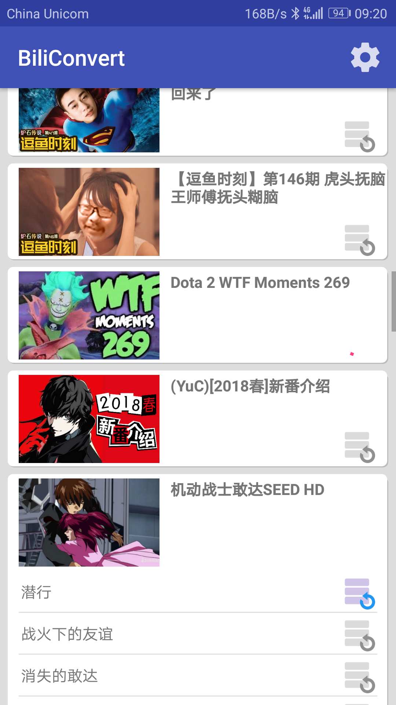

# BiliConvert
将BiliBili下载的分段视频文件合并，合成文件输出到用户指定文件夹
## Demo
<table> 
<tr>
<td></td>
<td></td>
<td></td>
</tr>
</table>

## Download
Version | Log
--- | ---
[BiliConvert-1.0.0-release](app/release/BiliConvert-1.0.0-release.apk?raw=true) | 初始版本
[BiliConvert-1.0.1-release](app/release/BiliConvert-1.0.1-release.apk?raw=true) | 修改导入库版本，设置界面添加Version
